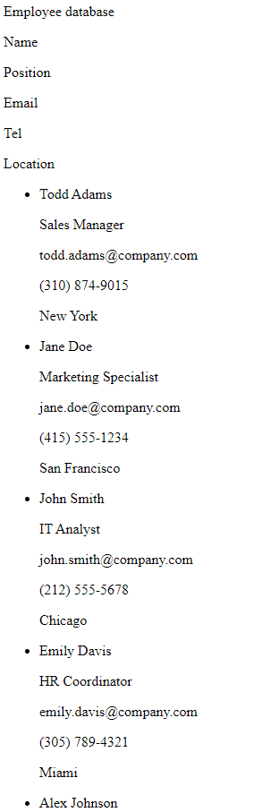
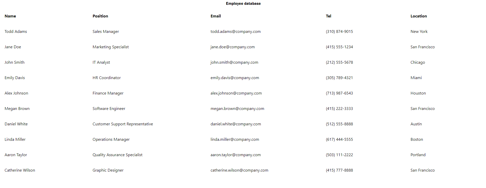
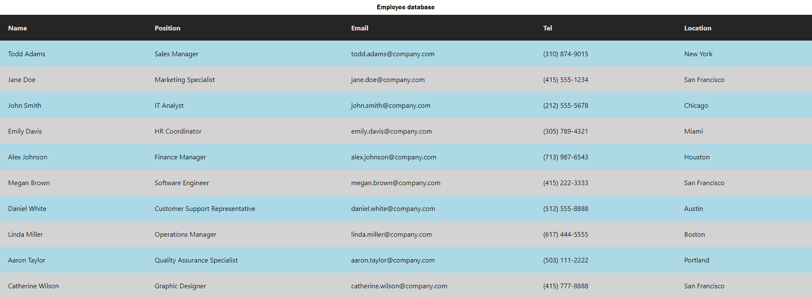

# Modul B Grid Assignment

## Task:

You have been given the HTML for the employee database of a company, using CSS Grid make it look like the goal picture below. If you need an extra challenge, you can do the stretch goal to alternate colors of the rows.

**other than adding classes / ID's, don't alter the HTML**

Hint: You only use "display:grid" once. Look up "display: contents"

### How the project looks in the start

### How the project should look when complete

### Stretch-goal to alternate colors (Not required, only for fun/practice)

